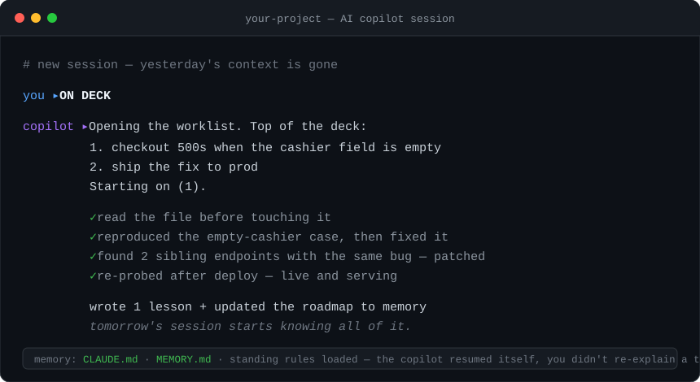

# Ground Control

**Mission control for your AI copilot — memory, discipline, and control from your first session.**



<sub><i>A fresh session with nothing in context. You type one short phrase you picked yourself — here it's "ON DECK" — and the copilot opens your worklist and carries on exactly where you left off. No re-explaining.</i></sub>

---

You started using an AI copilot. It's brilliant for ten minutes, then every new session it's a stranger again. You re-explain the same context every single day. It says "fixed" when it isn't. It wanders. You spend more time herding it than working.

Ground Control fixes that. It's a tiny starter kit — a handful of files you copy once — that turns a clever-but-forgetful assistant into a **reliable partner** that:

- **Remembers** — a file-based memory that survives every reboot, fresh start, and compaction (when your tool quietly drops the earlier conversation to make room)
- **Holds the standard** — a written contract of operating rules it must follow, every time
- **Stays under your control** — you steer, it rows; you never hand over the wheel

No app. No subscription. No account. No vendor. Five files and a habit.

## Who it's for

- **Solo operators** doing the work of a team, who need leverage without hiring
- **Second-career founders** building something real, with no time to waste on false starts
- **Anyone** who has thought *"why am I re-explaining this to the AI again?"*

If that's you, one sitting gets you a setup that stops costing you the same half-hour every morning.

## Quick start

### The fast way — let your agent do it (about 20 minutes)

Clone this repo anywhere, open it with your AI agent, and say **"help me set up."**

```bash
git clone https://github.com/akenel/ground-control.git
```

That's the whole instruction. This repo carries its own [`AGENTS.md`](AGENTS.md) written *to the agent*, so Claude Code, Codex, Cursor, aider and the rest arrive already knowing what this is and how to onboard you. It will read the kit, scaffold your spine, memory index and worklist, and come back with a short list of questions only you can answer — your mission, your code word, what you're building.

**Answer those questions and you're set up.** That's the twenty minutes: it's a conversation, not a copy-paste job.

> This is the path we recommend, and it's the one that gets tested. A kit about working with an AI copilot should be installed by one.

### The manual way — do it yourself (an hour or two)

Prefer to drive? Start your own repo from this one — click **"Use this template"** at the top of the page, or:

```bash
gh repo create my-project --template akenel/ground-control --private --clone
```

Then, **in your own project** (not in a clone of this one — see [Where the files go](#where-the-files-go)):

1. **Copy `kit/AGENTS.template.md`** in as `AGENTS.md` — or `CLAUDE.md`, or whatever file your tool reads ([see below](#it-isnt-just-for-one-tool--the-file-has-many-names)).
2. **Fill the blanks.** Who you are, what you're building, the paths that matter. This is the slow part, and it's slow because it's a self-interview, not typing.
3. **Paste in the rules** — drop `kit/STANDING-RULES.md` into that same spine file. These are the non-negotiables.
4. **Set up your memory** — follow `kit/MEMORY-SYSTEM.md`: a `MEMORY.md` index plus a `memory/` folder, one fact per file. The spine's **SESSION START** block already tells your copilot to read the index every session — keep that block or memory never gets loaded.
5. **Write your first worklist** — `kit/WORKLIST-TEMPLATE.md`. Without one, your code word has nothing to open.
6. **Prove it loaded.** Start a completely fresh session, say your code word, and watch. It should state the top items on your worklist without you explaining anything. **If it doesn't, your spine isn't being read** — check the filename matches what your tool actually loads, and that it's at your project root.

Step 6 is not optional. Rule 4 of the kit is *prove, don't assume*, and that applies to the kit itself.

### Where the files go

The spine belongs at the root of **the project you actually work in** — not inside a clone of this repo. If you cloned Ground Control to read it, copy the kit files out to your real project and work there. Your tool loads the context file at *its* working root; files sitting in a clone of this repo won't be picked up when you're working somewhere else.

If you used **"Use this template"**, your new repo *is* your project — fill in the spine there. One caveat: that repo's own `AGENTS.md` is Ground Control's onboarding file. Replace it with your filled-in spine; you won't need the onboarding twice.

## What's in the box

| File | What it does |
|------|--------------|
| [`kit/AGENTS.template.md`](kit/AGENTS.template.md) | The persistent-memory spine. Fill the blanks and your copilot loads your whole context every session. Save it as `AGENTS.md`, `CLAUDE.md`, or a system prompt. |
| [`kit/STANDING-RULES.md`](kit/STANDING-RULES.md) | The operating contract — the rules that turn a clever assistant into a reliable partner. |
| [`kit/MEMORY-SYSTEM.md`](kit/MEMORY-SYSTEM.md) | How to keep a growing file-based memory that doesn't rot — structure, index, hygiene. |
| [`kit/WORKLIST-TEMPLATE.md`](kit/WORKLIST-TEMPLATE.md) | The handoff document — how to write a worklist your copilot can execute without guessing. |
| [`kit/worked-example.md`](kit/worked-example.md) | One real loop, start to finish, so you can see the method before you trust it. |

## How the pieces fit

```
README ──────────► the pitch + quick start (you are here)
   │
   ├─► AGENTS.template ──► the spine you fill in — once
   │        │
   │        └─► STANDING-RULES ──► the discipline you paste in
   │
   ├─► WORKLIST-TEMPLATE ► what the code word points at — the deck
   │
   ├─► MEMORY-SYSTEM ────► how memory grows without rotting
   │
   └─► worked-example ───► proof it works, before you trust it
```

## It isn't just for one tool — the file has many names

Every serious AI coding agent now reads a project context file. They just disagree on what to call it:

| Where you work | What the file is called |
|---|---|
| Claude Code | `CLAUDE.md` |
| Codex, Gemini CLI, opencode, goose, Cursor, Zed, Copilot, Devin, Windsurf, Junie… | **`AGENTS.md`** — [an open format](https://agents.md/), used by 60k+ projects |
| Aider | `CONVENTIONS.md` — *and* `AGENTS.md` |
| Open-WebUI, LM Studio, any chat UI | the model's **system prompt** field |

Same job in all of them: *load who you are and how you work, before the conversation starts.*

**The filename is the easy part. Knowing what to put in it is the whole problem** — and that's what this kit is. `kit/AGENTS.template.md` is a template for that file whatever your tool calls it. Save it as `AGENTS.md`, paste it into a system prompt box, keep both — it's the same content doing the same work.

> **Tested, not assumed.** The same spine has been run three ways: as `CLAUDE.md` in Claude Code, as an Open-WebUI system prompt against a hosted model, and as `CONVENTIONS.md` driving [Aider](https://aider.chat) with Qwen on Ollama. Three tools, three vendors, one file. In the terminal test it went from silently writing pointless code to *"I need to push back on this request"* — same model, same settings, **only the spine changed.**

If you switch tools next year, you rewrite one filename. That's the point of owning your context instead of renting it.

## ▶ Built with this method — play it

**TIG · Tempest** is a complete arcade game, a tribute to the 1981 classic, built in a **single session** on nothing but the spine in this kit — a human steering, a copilot rowing, every step written to files.

**[▶ Play it live → wolfhold.app/tempest](https://www.wolfhold.app/tempest)** — deployed the same day it was built, and still serving. It ships inside [Freehold](https://github.com/akenel/freehold), spine and worklist and memory files included, because a kit you can read in one sitting beats a kit padded with the things it built.

## What this is not

Worth being straight about, before you spend the half hour:

- **It is not software.** Five markdown files and a habit. Nothing to install, nothing to run, nothing that can break.
- **It will not make your copilot correct.** It makes it *consistent* — it remembers your context, follows your rules, and tells you when it hasn't verified something. A confidently wrong answer is still a confidently wrong answer.
- **It will not write your worklist for you.** You still have to decide what matters and say so clearly. The kit is what turns that decision into work; it isn't the decision.
- **It is not automated.** Memory grows because you write to it at the end of a session. Skip that habit and this is just a folder of templates.

If you want a tool that thinks for you, this isn't it. It's for people who already know what they want and are tired of explaining it every morning.

## The one rule that makes it all work

> **Write to files, not chat.** Chat is water — it evaporates at the next compaction. Files are stone. Anything that matters goes into a file your copilot reads next session, or it never happened.

And its harder half: write it to the file that **actually gets read**, in the same breath as the change. A file nobody opens is chat with extra steps, and a file that is confidently out of date is worse than no file at all — because it gets trusted.

Everything else here is downstream of that one habit.

---

## Contributing

Found this useful? Confused by something? [Open an issue](../../issues) or start a [discussion](../../discussions). The confusion of the first stranger is the roadmap for the next version.

## License

[CC BY 4.0](LICENSE) — use it, adapt it, build on it, ship it in your own work. Just keep the credit.

*Ground Control is free and open, and this is all of it — the whole method, in five files. Built by Angelo Kenel.*
